# Event Storming — flujo de reserva de esterilización

Modelo visual del flujo conversacional y de agenda para el caso **reserva de esterilización** (perro/gato).  
Ticket: [SCRUM-14](https://ivancordonesnunez.atlassian.net/browse/SCRUM-14) (VET-14).

## Leyenda (notación)

| Estilo / color | Significado |
| :--- | :--- |
| **Command** (azul) | Orden o paso que el sistema o el agente ejecuta (pregunta, acción). |
| **Event** (naranja) | Algo que ha ocurrido y queda registrado en el flujo. |
| **Policy** (morado) | Regla de decisión o cálculo (negocio). |
| **Aggregate** (amarillo) | Agregado de dominio (aquí: agenda). |
| **Read model** (verde) | Vista derivada mostrada al usuario (p. ej. ventana horaria). |

Los nodos redondos `((...))` representan **inicio / fin** de recorridos alternativos.

## Diagrama (Mermaid)

Copia el bloque siguiente en un visor compatible con Mermaid (GitHub, Notion, Mermaid Live Editor) para renderizarlo.

```mermaid
graph TD
    %% Styles for Event Storming Elements
    classDef command fill:#0052cc,stroke:#fff,stroke-width:2px,color:#fff;
    classDef event fill:#ff9900,stroke:#fff,stroke-width:2px,color:#fff;
    classDef policy fill:#b300b3,stroke:#fff,stroke-width:2px,color:#fff;
    classDef aggregate fill:#ffff00,stroke:#333,stroke-width:2px,color:#000;
    classDef readmodel fill:#ccffcc,stroke:#333,stroke-width:2px,color:#000;

    %% Flow Start
    Start((Inicio)) --> CMD_Ident[Identify User / Intent]:::command
    CMD_Ident --> EVT_UserIdent[User Identified]:::event
    EVT_UserIdent --> POL_CheckPets(Policy: Check # Pets):::policy

    %% Path: Multiple Pets
    POL_CheckPets -->|"> 1 Pet"| EVT_Call[Redirect to Phone Call]:::event
    EVT_Call --> EndCall((End))

    %% Path: Single Pet
    POL_CheckPets -->|1 Pet| CMD_AskNew[Ask: Is it a new pet?]:::command
    CMD_AskNew --> EVT_NewPetStatus[Pet Status Received]:::event

    EVT_NewPetStatus -->|Yes / Unknown| CMD_AskDetails[Ask Species, Sex, Weight]:::command
    CMD_AskDetails --> EVT_DetailsReceived[Details Received]:::event
    EVT_DetailsReceived --> POL_Species(Policy: Species?):::policy

    %% CAT PATH
    POL_Species -->|Cat| CMD_AskHeatCat[Ask: In Heat? Info]:::command
    CMD_AskHeatCat --> EVT_CatInfo[Cat Info Complete]:::event
    EVT_CatInfo --> POL_CalcTime_Cat["Policy: Calculate Time (Cat: Male 12m, Female 15m)"]:::policy

    %% DOG PATH
    POL_Species -->|Dog| CMD_AskHeat_Dog[Ask: In Heat?]:::command
    CMD_AskHeat_Dog --> POL_CheckHeat_Dog(Policy: In Heat?):::policy
    POL_CheckHeat_Dog -->|Yes| EVT_RejectHeat[Reject: Wait 2 months]:::event
    EVT_RejectHeat --> EndHeat((End))
    POL_CheckHeat_Dog -->|No| POL_CalcTime_Dog["Policy: Calculate Time (Dog: Male 30m, Female 45-70m by weight)"]:::policy

    %% THE TETRIS (Scheduling Logic)
    POL_CalcTime_Cat --> CMD_CheckAvail[Command: Check Availability]:::command
    POL_CalcTime_Dog --> CMD_CheckAvail

    subgraph The_Tetris_Algorithm["The Tetris Algorithm"]
        CMD_CheckAvail --> AGG_Agenda[Agenda Aggregate]:::aggregate
        AGG_Agenda --> POL_Rule1["Rule 1: Daily Limit <= 240min?"]:::policy
        POL_Rule1 -->|No| EVT_NoSlot[Slot Unavailable]:::event
        POL_Rule1 -->|Yes| POL_Rule2["Rule 2: If Dog, Total Dogs <= 2?"]:::policy
        POL_Rule2 -->|No| EVT_NoSlot
        POL_Rule2 -->|Yes| EVT_SlotFound[Valid Slots Found]:::event
    end

    EVT_NoSlot --> CMD_NextDay[Check Next Day]:::command
    CMD_NextDay --> AGG_Agenda

    %% CONFIRMATION & EXTRAS
    EVT_SlotFound --> CMD_ShowDates[Show Available Dates]:::command
    CMD_ShowDates --> EVT_DatesShown[Dates Displayed]:::event
    EVT_DatesShown --> CMD_SelectDate[User Selects Date]:::command
    CMD_SelectDate --> EVT_DateSelected[Date Selected]:::event

    EVT_DateSelected --> CMD_AskExtras[Ask: Microchip / Rabies?]:::command
    CMD_AskExtras --> EVT_ExtrasRecorded[Extras Recorded]:::event
    EVT_ExtrasRecorded --> POL_AssignWindow(Policy: Assign Delivery Window):::policy

    POL_AssignWindow -->|Cat| READ_WindowCat[Window: 08:00 - 09:00]:::readmodel
    POL_AssignWindow -->|Dog| READ_WindowDog[Window: 09:00 - 10:30]:::readmodel

    READ_WindowCat --> CMD_FinalConfirm[Confirm Appointment]:::command
    READ_WindowDog --> CMD_FinalConfirm
    CMD_FinalConfirm --> EVT_ApptBooked[Appointment Booked]:::event

    EVT_ApptBooked --> CMD_SendInstructions[Send Fasting Instructions & Consent Form]:::command
    CMD_SendInstructions --> EndSuccess((Success End))
```

## Notas

- Las duraciones y reglas numéricas del diagrama se alinean con el detalle en [business-rules.md](business-rules.md).
- Una copia orientada a agentes vive en `.cursor/docs/event-storming-sterilization-booking.md`.

## Enlaces

- [Glosario y reglas preparatorias](glossary-and-preparation.md)
- [Reglas de negocio operativas](business-rules.md)
